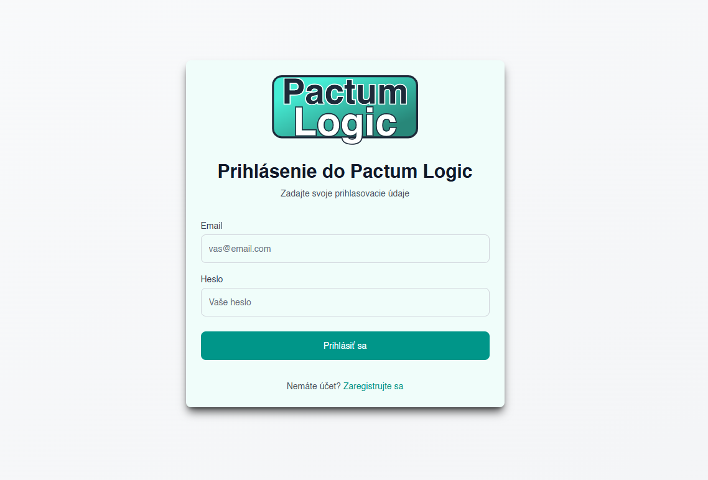
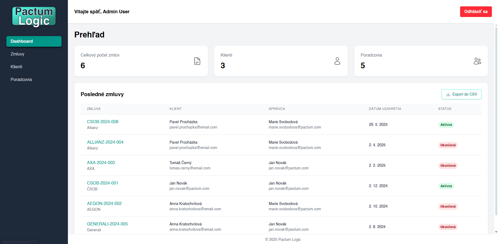
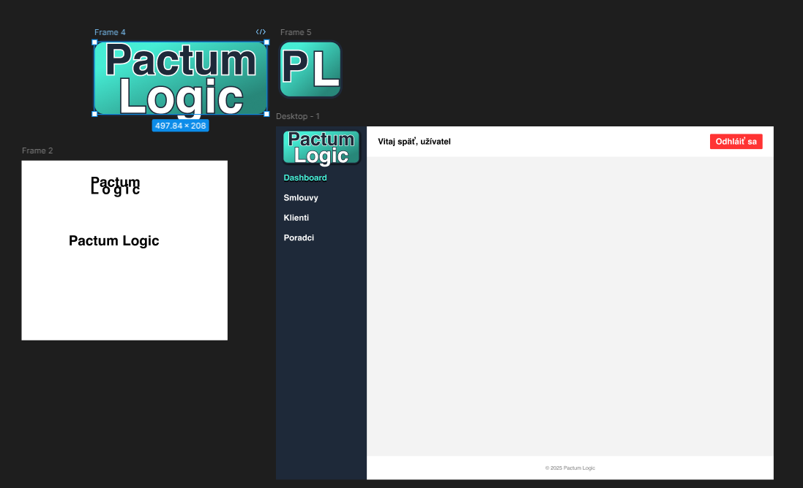

# PactumLogic - Správa Zmlúv

**PactumLogic** je webová aplikácia pre správu zmlúv a klientov. Názov pochádza z latinského slova "pactum" (zmluva).

## O projekte

Aplikácia slúži ako **ukážka moderného full-stack vývoja** a demonštruje:

- Responzívny React frontend s TypeScript
- RESTful API s .NET Core
- JWT autentifikáciu a ASP.NET Core Identity
- Entity Framework databázové operácie
- Export dát do CSV
- Moderný dizajn s Tailwind CSS

### Dizajn a UX

Aplikácia bola navrhnutá vo **Figme** vrátane vlastného loga a dizajnu systému. Využíva **Tailwind CSS** pre moderný a responzívny dizajn.

## Technológie

### Frontend

- **React 18** s **TypeScript** pre type-safe vývoj
- **Vite** pre rýchly development a build
- **Tailwind CSS** pre responzívny dizajn

### Backend

- **ASP.NET Core 8.0** Web API
- **Entity Framework Core** pre ORM
- **ASP.NET Core Identity** pre správu používateľov
- **JWT Authentication** pre bezpečnosť

### Databáza

- **Microsoft SQL Server**
- Seedovanie testovacích dát
- Migrácie pomocou EF Core

## Splnenie zadania

### Základné požiadavky

- **Správa zmlúv** - evidenčné číslo, inštitúcia, klient, správca, dátumy
- **Evidencia klientov a poradcov** - meno, priezvisko, email, telefón, rodné číslo, vek
- **Zoznamy s detailmi**
- **CRUD operácie**
- **SPA architektúra**

### Nepovinné body

- **Filtrovanie** - podľa statusu, dátumov
- **Responzívny dizajn**
- **Autentifikácia** - JWT tokeny s ASP.NET Core Identity
- **CSV export**
- **ASP.NET Core API** - RESTful backend
- **SQL Server** - databáza s migráciami

## Funkcionality

### Dashboard

- počet zmlúv, klientov, poradcov
- Zobrazenie najnovších zmlúv

### Správa Zmlúv

- Vytváranie nových zmlúv s validáciou
- Detail a úprava existujúcich zmlúv
- Filtrovanie podľa statusu a dátumov
- Mazanie
- Podpora viacerých poradcov na zmluvu

### Správa Klientov a Poradcov

- Detail klienta s prehľadom všetkých zmlúv
- Ochrana pred mazaním pri existujúcich zmluvách

### Export

- CSV export všetkých dát

## Bezpečnosť

- **JWT tokeny** pre autentifikáciu
- **ASP.NET Core Identity** pre správu používateľov
- **Server-side validácia** všetkých dát
- **Client-side validácia** pre lepší UX

## Inštalácia a spustenie

### Predpoklady

- .NET 8.0 SDK
- Node.js 18+
- SQL Server

### Kroky spustenia

1. Spustite migrácie: `dotnet ef database update`
2. Spustite backend: `dotnet run`

### Testovanie

**Admin účet:**

- Tento účet je prednastavený pre rýchle testovanie aplikácie. (Zaseedený v databáze)
- Email: `admin@pactum.com`
- Heslo: `Admin123!`

Alebo si vytvorte vlastný účet cez registráciu.

## Používateľská časŤ

### Prihlásenie a registrácia

1. Otvorte aplikáciu v prehliadači
2. Prihláste sa pomocou admin účtu alebo sa zaregistrujte
3. Po prihlásení budete presmerovaní na dashboard

### Práca so zmluvami

1. **Zobrazenie** - navigujte na "Zmluvy" pre zoznam všetkých zmlúv
2. **Filtrovanie** - použite filtre pre aktívne/ukončené zmluvy alebo dátumový rozsah
3. **Vytvorenie** - kliknite "Nová zmluva" a vyplňte formulár
4. **Detail** - kliknite na evidenčné číslo pre detail
5. **Úprava** - v detaile kliknite "Upraviť"
6. **Export** - použite tlačidlo "Export do CSV"

### Práca s klientmi a poradcami

1. **Zoznamy** - navigujte na "Klienti" alebo "Poradcovia"
2. **Vytvorenie** - kliknite "Nový klient/poradca"
3. **Detail** - kliknite na meno pre zobrazenie detailu so zmluvami
4. **Úprava** - v detaile kliknite "Upraviť"

## Technická časť

### Databázová štruktúra

- **Users** - používatelia systému (ASP.NET Core Identity)
- **Clients** - klienti a poradcovia (rozlíšené enum typom)
- **Contracts** - zmluvy s väzbou na klienta a správcu
- **ContractAdvisors** - väzobná tabuľka pre poradcov na zmluve

---
